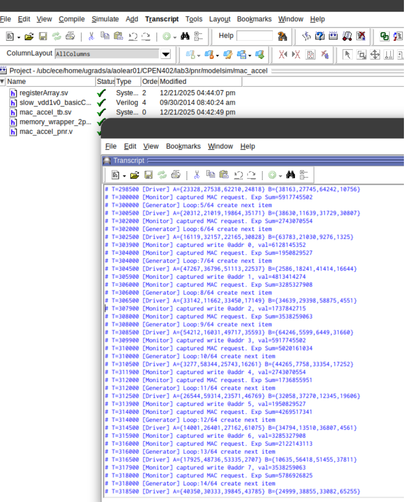
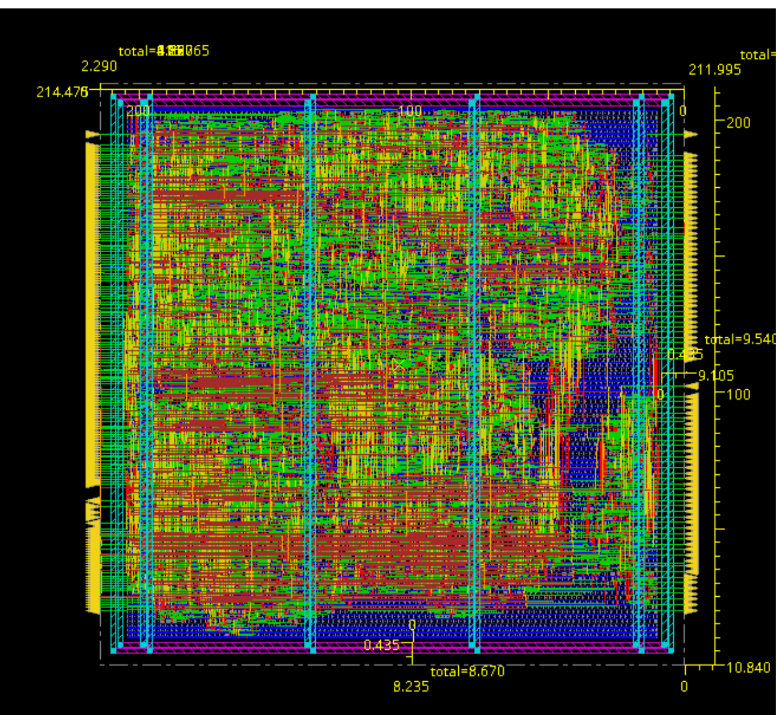

# MAC Accelerator (mac_accel)

A high-speed, **5-stage pipelined** MAC accelerator designed for 1x4 matrix dot products. Optimized to meet a **500 MHz** timing target under realistic physical constraints, including clock uncertainty and defined I/O delays. The design was validated across the full silicon flow—**RTL, Post-Synthesis, and Post-Layout**—using SystemVerilog Constrained Random Verification (CRV).

## Testbench & Verification (Modelsim)

Testbench files are located in the `modelsim/` directory. This includes the scripts used to set up the simulation; however, Genus or Innovus netlist outputs required for post-synthesis or post-layout testing are not included in this repository.

### Testbench Methodology
The environment utilizes a modular approach with a **Generator** and **Driver** communicating with the DUT over a shared interface. A **Monitor** and **Scoreboard** are used to validate outputs against a reference model. Timing closure for the verification environment was achieved by aligning input stimulus with the delays defined in the SDC file.

**Example Testbench Output:**

Post-layout waveforms demonstrating interface timing are available in the `images/` directory.

---

## Synthesis (Genus)

The scripts used for compilation are located in the `genus/` directory. 

### Design Constraints & Environment
To ensure design robustness across various operating conditions, the following SDC constraints were applied during synthesis and layout:

* **Input Drive Strength:** All inputs (excluding `CLK` and `RST_N`) are modeled using **minimum-sized D-flipflops (DFFX1)** as driving cells, with transition times constrained to **1/8 of the clock cycle** (250ps).
* **Output Loading:** All output pins drive a load equivalent to **4x the input capacitance** of a `NAND2X4` (Pin A) standard cell to ensure realistic fan-out modeling.
* **I/O Timing Window:** Input and output delays are set to **1/4 of the clock cycle** (500ps). This requires the input-to-flop and flop-to-output paths to remain stable within a quarter-cycle window.
* **Clock Network Modeling:** Both **Clock Latency** and **Clock Uncertainty** are defined as **1/8 of the clock cycle** (250ps) to account for jitter and insertion delay.
* **Fanout Control:** A maximum fanout limit of **4** is enforced for all input nets to maintain signal integrity and prevent slope degradation.

---

## Physical Design (Innovus)

The layout process involved floorplanning, power grid synthesis, placement, Clock Tree Synthesis (CTS), and routing. Each stage was partitioned into separate scripts to allow for detailed analysis of the design's physical evolution.

> **Note:** For future implementation, before the CTS stage, the clock tree must be initialized via:  
> `Clock -> CCOpt Tree Debugger -> Apply`

### PNR Metrics Comparison
| Metric | Synthesized (Genus) | Post-Layout (Innovus) |
| :--- | :--- | :--- |
| **Total Core Area** | 18,787.72 µm² | 45,747.52 µm² |
| **Setup Slack** | 0.2 ps | 90.0 ps |
| **Clock Frequency** | 500 MHz | 500 MHz |
| **Standard Cell Library** | GPDK 45nm | GPDK 45nm |

**Completed Layout:**

---

## Improvements & Future Work

Throughout this project, my focus was on mastering the full PNR process and optimizing designs for Genus compilation. Additionally, I aimed to develop a more formal verification methodology and build UVM intuition.

Future improvements for subsequent testbench designs include:
* **Output Refinement:** Implementing a less verbose logging system for successful test cases.
* **Test Tracking:** Adding coverage metrics to identify and track missed test cases.
* **UVM Migration:** Transitioning from a class-based environment to a formal **UVM (Universal Verification Methodology)** framework.
